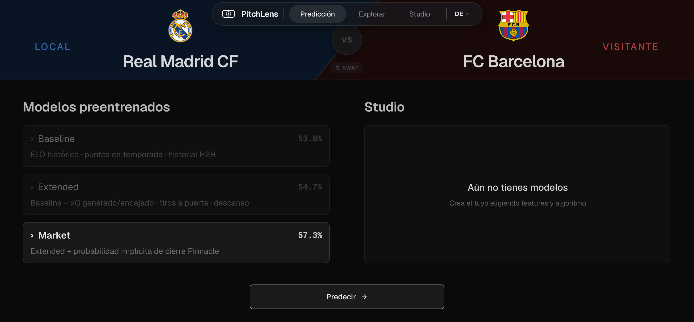
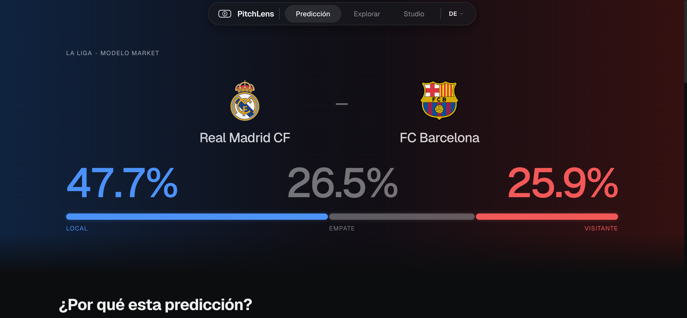
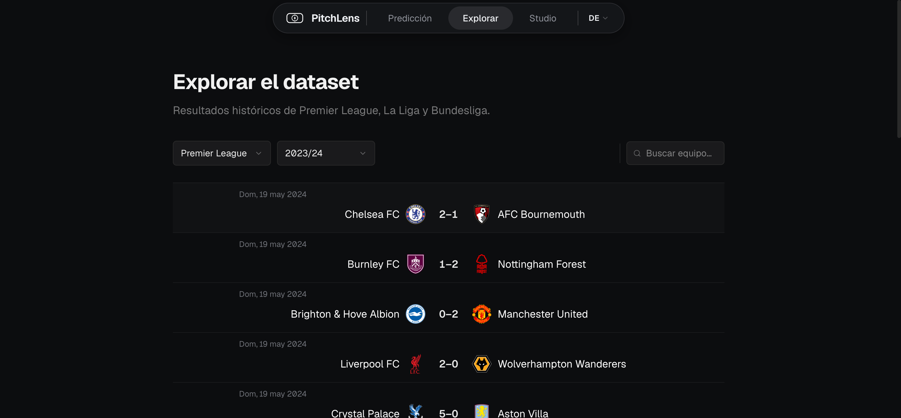
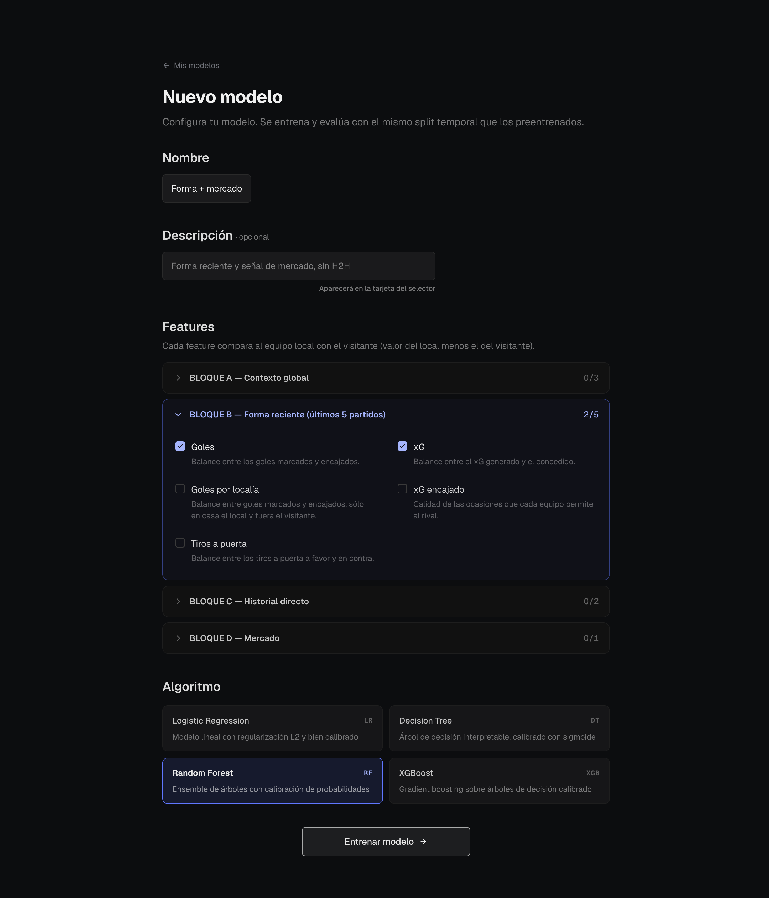
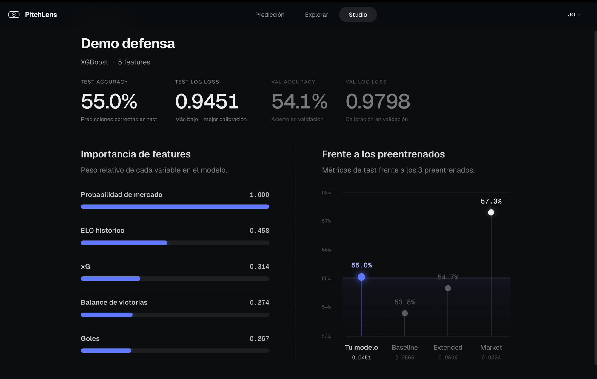

# PitchLens

Aplicación web de predicción de resultados de fútbol —local, empate o visitante (1·X·2)— con machine learning, desarrollada como Trabajo de Fin de Grado.

Implementa el pipeline completo de un proyecto de ciencia de datos: ingesta y limpieza de datos, integración de Expected Goals (xG), ingeniería de características con garantía anti-leakage, modelado con validación temporal, una API REST con FastAPI y un frontend SPA en React.

## Qué hace

A partir de una liga y dos equipos, PitchLens estima la probabilidad de cada resultado (1·X·2) y explica en qué se apoya la predicción. No depende de partidos reales programados: el usuario elige cualquier emparejamiento y la API calcula las características al vuelo desde el historial reciente de cada equipo.

### Pantallas

- **Predictor** — eliges liga, equipo local, equipo visitante y modelo, y obtienes la predicción. Avisa cuando algún equipo no tiene historial suficiente (*cold start*).
- **Detalle de predicción** — probabilidades H/D/A, importancia de cada feature y, con el modelo *Market*, comparación frente a las cuotas de mercado; además, las estadísticas recientes de ambos equipos.
- **Explorador** — estadísticas históricas con filtros por liga, temporada y equipo.
- **Studio** *(requiere registro)* — construye tu propio modelo: seleccionas features y algoritmo, lo entrenas y comparas sus métricas (Accuracy, Log Loss) con los preentrenados. El modelo resultante queda disponible en el selector principal.

## Capturas

| Predictor | Detalle de predicción |
|---|---|
|  |  |

| Explorador | Studio — configuración |
|---|---|
|  |  |

**Studio — comparación con los modelos preentrenados**

Tras entrenar, Studio enfrenta tu modelo (Test Accuracy y Log Loss) a los tres preentrenados y muestra la importancia de cada feature.



## Características

- **3 modelos preentrenados** (baseline, extended, market), todos con Regresión Logística para aislar el efecto de las features.
- **12 features con garantía anti-leakage**: ELO pre-partido, forma reciente (medias móviles), xG, días de descanso, cuotas de cierre de Pinnacle y head-to-head.
- **Modelos personalizados** en Studio: Regresión Logística, Árbol de Decisión, Random Forest y XGBoost, con entrenamiento asíncrono.
- **Datos reales**: 3 ligas (LaLiga, Premier League, Bundesliga), 10 temporadas (2014/15–2023/24), 10 660 partidos, con xG de Understat.
- **Visualizaciones a medida** en SVG + CSS, sin librería de gráficos externa.
- **Autenticación JWT** para las funciones de modelado.

## Resultados

Validación temporal estricta (nunca split aleatorio): entrenamiento ≤ 2022, validación 2023, test 2024 (temporada nunca vista).

| Modelo | Nº features | Test Accuracy | Test Log Loss |
|---|---|---|---|
| baseline | 5 — ELO, puntos, H2H | 53.8 % | 0.957 |
| extended | 11 — + forma, xG, descanso | 54.7 % | 0.951 |
| market | 6 — + cuotas Pinnacle | **57.3 %** | **0.932** |

Baseline de referencia (predecir siempre la clase mayoritaria): 45.6 %.

## Stack

Python 3.13 · pandas / numpy / scikit-learn · FastAPI + SQLModel + PostgreSQL · React + Vite + TypeScript.

## Arquitectura

Pipeline de datos y servicio, de extremo a extremo:

```
EDA → limpieza → integración xG → feature engineering → BD (star schema) → modelado → API REST → frontend SPA
```

Los datos en bruto (`data/raw/`) se transforman en los notebooks (`notebooks/`) hasta `core_features.parquet`; el ETL puebla una base de datos PostgreSQL con star schema (`leagues`, `teams`, `seasons`, `matches`, `match_features`); la API construye las features de cada predicción on-the-fly desde la BD y sirve los modelos.

## Puesta en marcha (bootstrap)

**Arranque rápido (todo automático):**

```bash
./start.sh   # entorno + dependencias + BD + seed + modelos + API + frontend
```

Requisitos: Python 3.13, Docker y Node.js. O, paso a paso:

```bash
# 1. Entorno virtual
python -m venv .venv && source .venv/bin/activate

# 2. Dependencias
pip install -r requirements.txt -r requirements-ml.txt   # API + ML
pip install -r requirements-dev.txt                      # además, para tests

# 3. Configuración
cp .env.example .env        # edita DATABASE_URL y JWT_SECRET_KEY

# 4. Base de datos PostgreSQL local
docker compose up -d db

# 5. Seed de la BD desde los parquets procesados (idempotente)
python -m src.db.etl         # no inserta nada si ya está poblada
# python -m src.db.etl --wipe # recrear desde cero

# 6. Entrenar los 3 modelos preentrenados (genera models/*.pkl + metrics.json)
python -m src.ml.train_models

# 7. Arrancar la API
uvicorn src.api.main:app --reload
```

Para el frontend:

```bash
cd frontend
npm install
npm run dev
```

Los artefactos `models/*.pkl` están en `.gitignore` (reproducibles con el paso 6). La API arranca aunque falten: el warmup degrada a carga lazy en lugar de impedir el arranque, y la primera predicción los usa si existen o devuelve un error claro indicando ejecutar el paso 6.

## Tests

```bash
pytest -m "not integration"   # rápidos, SQLite en memoria, sin Postgres
pytest                        # incluye integración (requiere API arrancada + datos reales)
```

## Despliegue

El frontend es un build estático en Vercel; la API corre en un VPS con Docker,
detrás de Caddy como *reverse proxy* con TLS automático.

```
pitchlens.es (Vercel) ──fetch──▶ api.pitchlens.es (VPS) ──▶ Caddy ──▶ :8000 API ──▶ :5432 PostgreSQL
```

Ni la API ni PostgreSQL se exponen a internet: ambos publican sus puertos
contra `127.0.0.1` y solo Caddy actúa de puerta de entrada. Los contenedores
usan `restart: unless-stopped`, así que el servicio se recupera solo tras un
reinicio del servidor.

Detalles de operación —despliegue de una versión nueva, backups y restauración,
mantenimiento del sistema— en [`docs/08_despliegue.md`](docs/08_despliegue.md).
La configuración de producción está en [`deploy/`](deploy/).

## Estructura

- `src/ingest/`, `notebooks/` — ingesta y EDA/limpieza/features (pipeline de datos).
- `src/features/` — feature engineering (anti-leakage vía `shift(1)`).
- `src/db/` — star schema SQLModel + seed (`etl.py`).
- `src/ml/` — entrenamiento (`train_models.py`, `custom_trainer.py`) y predicción (`predictor.py`).
- `src/services/` — capa de aplicación: construcción de features para una predicción.
- `src/api/` — FastAPI: routers, auth JWT y esquemas.
- `frontend/` — SPA React + Vite + TypeScript.
- `tests/` — pytest (pipeline de datos, modelos y API).
