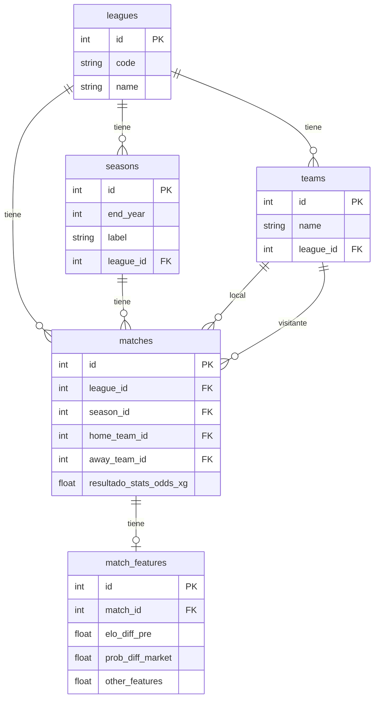

# Football Analytics TFG — Estado del proyecto

Aplicación web de predicción de resultados de fútbol (H/D/A) con ML.
**3 ligas · 10 temporadas · 2014–2024**

---

## Stack

Python 3.13 · pandas / numpy / scikit-learn · FastAPI · SQLModel · PostgreSQL · React + Vite · Recharts

---

## Estado por fases

| Fase | Contenido | Estado |
|---|---|---|
| 1 | EDA estructural — validación por liga | ✅ |
| 2 | Cleaning → `core_multi_league_clean.parquet` | ✅ |
| 3 | Integración xG (Understat) → `core_enriched.parquet` | ✅ |
| 4 | Feature Engineering → `core_features.parquet` | ✅ |
| 5 | EDA analítico de features | ✅ |
| 6 | BD PostgreSQL star schema + seed + endpoints GET | ✅ |
| 7 | Modelado ML — 3 modelos preentrenados + modo custom | ✅ |
| 8 | FastAPI extendida — `/predict`, `/train`, JWT | ⏳ |
| 9 | Frontend React + Vite | ⏳ |

---

## Evolución del dataset

| Etapa | Artefacto | Partidos | Columnas | Nulos |
|---|---|---|---|---|
| RAW | 30 CSVs (10 por liga) | 10.661 | 67–68 | ~488.000 |
| Fase 1 — Validación | `core_validated × 3` | 10.660 | 43–44 | 1.725 |
| Fase 2 — Limpieza | `core_multi_league_clean` | 10.660 | 33 | **0** |
| Fase 3 — Enriquecimiento con xG | `core_enriched` | 10.660 | 35 | **0** |
| Fase 4 — Feature Engineering | `core_features` | **9.792** | 19 | **0** |

### Fase 2 — Limpieza
- Eliminadas 13 columnas: 12 de casas de apuestas con cobertura incompleta y `Div` (redundante con `League`). 
- Se conservan Bet365 (cobertura completa, referencia estándar) y Pinnacle (menor margen, cuotas más eficientes, base de `prob_diff_market`).  
- Añadidas `League`, `Season` y `match_id` — clave `{liga}_{temporada}_{local}_{visitante}` para el join posterior.  
- Nulos residuales en Pinnacles, imputados por media de liga/temporada.
- `leagues.json` — mapeo del código interno (`DIV`) de football-data.co.uk (`E0` → `premier`, `SP1` → `laliga`, `D1` → `bundesliga`) para crear la columna `League` normalizada.

### Fase 3 — Enriquecimiento con xG
- Previo al join: `league_mapping.json` traduce los nombres de liga de Understat al formato interno (`ENG-Premier League` → `premier`). Mapeo manual de 3 entradas.
- Nombres de equipos alineados mediante fuzzy matching automático en 3 rondas (exacto → substring → mejor ratio), resultado guardado en `team_mapping_xg.json` (35 equipos). Garantiza que el `match_id` construido en ambas fuentes sea idéntico.
- Join por `match_id`. Coincidencia completa (100 %). Añadidas `home_xg` y `away_xg`.  

### Fase 4 — Filtrado por cold start
- Eliminados 868 partidos (8,1 %) sin historial suficiente para features rolling.  
- Distribución `FTR` estable:  
  - H: 45,2 % → 45,6 %  
  - D: 24,7 % → 24,7 %  
  - A: 30,1 % → 29,8 % 

---

## core_enriched — esquema final

**10.660 filas × 35 columnas · 0 nulos · 2014-08-16 → 2024-05-26**

| Grupo | Columnas |
|---|---|
| Identificación | `Date`, `HomeTeam`, `AwayTeam`, `League`, `Season`, `match_id` |
| Resultado | `FTHG`, `FTAG`, `FTR`, `HTHG`, `HTAG`, `HTR` |
| Estadísticas | `HS`, `AS`, `HST`, `AST`, `HF`, `AF`, `HC`, `AC`, `HY`, `AY`, `HR`, `AR` |
| Cuotas Bet365 | `B365H`, `B365D`, `B365A` |
| Cuotas Pinnacle apertura | `PSH`, `PSD`, `PSA` |
| Cuotas Pinnacle cierre | `PSCH`, `PSCD`, `PSCA` |
| Expected Goals | `home_xg`, `away_xg` |

Muestra (3 primeras filas):

| Date | HomeTeam | AwayTeam | League | FTR | FTHG | FTAG | home_xg | away_xg | PSCH | PSCA |
|---|---|---|---|---|---|---|---|---|---|---|
| 2014-08-16 | Arsenal | Crystal Palace | premier | H | 2 | 1 | 1.554 | 0.158 | 1.29 | 12.75 |
| 2014-08-16 | Leicester | Everton | premier | D | 2 | 2 | 1.278 | 0.613 | 3.11 | 2.47 |
| 2014-08-16 | Man United | Swansea | premier | A | 1 | 2 | 1.166 | 0.278 | 1.45 | 8.25 |

---

## Features — 12 en total

| Bloque | Feature | Descripción |
|---|---|---|
| A — Nivel | `elo_diff_pre` | ELO histórico acumulado pre-partido (K=20, base=1500). Home − Away |
| A — Nivel | `points_diff_global` | Puntos acumulados en la temporada (todos los partidos). Home − Away |
| A — Nivel | `points_diff_venue` | Puntos acumulados en la temporada por localía. Home − Away |
| B — Forma | `goal_diff_last5_global` | Goal diff rolling 5 (global). Home − Away |
| B — Forma | `goal_diff_last5_venue` | Goal diff rolling 5 por localía. Home − Away |
| B — Forma | `sot_diff_last5_global` | Tiros a puerta rolling 5 (global). Home − Away |
| B — Forma | `xg_diff_last5_global` | xG generado rolling 5 (global). Home − Away |
| B — Forma | `xg_conceded_diff_last5_global` | xG concedido rolling 5 (global). Home − Away |
| C — Descanso | `rest_days_diff` | Días desde el último partido en la temporada. Home − Away |
| D — Mercado | `prob_diff_market` | (1/PSCH − 1/PSCA) normalizado por overround. Pinnacle cierre |
| E — H2H | `h2h_goal_diff_last5` | Media del goal diff en los últimos 5 H2H. Cold start = 0 |
| E — H2H | `h2h_result_diff_last5` | (wins_home − wins_away) / 5 en los últimos 5 H2H. Cold start = 0 |

Anti-leakage: todas las features rolling usan `shift(1)` antes de `rolling`/`cumsum`. El ELO registra el valor pre-partido por construcción. Las cuotas Pinnacle de cierre son información pública previa al partido.

---

## core_features — esquema final

**9.792 filas × 19 columnas · 0 nulos · cold start excluido**

| Grupo | Columnas |
|---|---|
| Identificación | `match_id`, `League`, `Season`, `Date`, `HomeTeam`, `AwayTeam` |
| Target | `FTR` (H / D / A) |
| Features (12) | `elo_diff_pre`, `points_diff_global`, `points_diff_venue`, `goal_diff_last5_global`, `xg_diff_last5_global`, `xg_conceded_diff_last5_global`, `sot_diff_last5_global`, `goal_diff_last5_venue`, `rest_days_diff`, `prob_diff_market`, `h2h_goal_diff_last5`, `h2h_result_diff_last5` |

Muestra (3 primeras filas con historial suficiente):

| Date | HomeTeam | AwayTeam | League | FTR | elo_diff_pre | points_diff_global | prob_diff_market | h2h_goal_diff_last5 |
|---|---|---|---|---|---|---|---|---|
| 2014-11-07 | Cordoba | La Coruna | laliga | D | -9.14 | -3.0 | 0.261 | 0.0 |
| 2014-11-07 | Hertha | Hannover | bundesliga | A | -27.16 | -5.0 | 0.225 | 0.0 |
| 2014-11-08 | Burnley | Hull | premier | H | -45.30 | -7.0 | 0.066 | 0.0 |

---

## EDA analítico — hallazgos clave

**Poder discriminativo (η²)**

| Feature | η² | Nivel |
|---|---|---|
| `prob_diff_market` | 0,189 | Alto |
| `elo_diff_pre` | 0,148 | Alto |
| `points_diff_global` | 0,110 | Medio-alto |
| `xg_diff_last5_global` | 0,102 | Medio-alto |
| `sot_diff_last5_global` | 0,096 | Medio-alto |
| `goal_diff_last5_global` | 0,084 | Medio |
| `goal_diff_last5_venue` | 0,082 | Medio |
| `points_diff_venue` | 0,080 | Medio |
| `h2h_goal_diff_last5` | 0,050 | Bajo |
| `xg_conceded_diff_last5_global` | 0,049 | Bajo |
| `h2h_result_diff_last5` | 0,044 | Bajo |
| `rest_days_diff` | ≈ 0,000 | Residual |

**Colinealidad relevante (|r| > 0,80)**

| Par | r |
|---|---|
| `h2h_goal_diff_last5` ↔ `h2h_result_diff_last5` | 0,91 |
| `prob_diff_market` ↔ `elo_diff_pre` | 0,90 |
| `points_diff_global` ↔ `points_diff_venue` | 0,84 |
| `xg_diff_last5_global` ↔ `sot_diff_last5_global` | 0,83 |
| `elo_diff_pre` ↔ `points_diff_global` | 0,83 |
| `xg_diff_last5_global` ↔ `xg_conceded_diff_last5_global` | 0,80 |

**Los empates no son predecibles** con stats pre-partido: correlación con D ≈ 0 en todas las features. Es un límite estructural de la tarea, no del modelo.

---

## Base de datos — star schema

| Tabla | Filas | Contenido |
|---|---|---|
| `leagues` | 3 | Premier League, LaLiga, Bundesliga |
| `seasons` | 30 | 10 temporadas × 3 ligas |
| `teams` | 93 | Sin equipos compartidos entre ligas |
| `matches` | 10.660 | Hechos: resultado + stats + odds + xG |
| `match_features` | 9.792 | Features derivadas (FK única a matches) |

`match_features` separada de `matches` por diseño: los hechos son inmutables; las features pueden regenerarse sin tocar la fuente de verdad. Los 868 partidos de cold start existen en `matches` pero no en `match_features`.

### Endpoints GET implementados

| Endpoint | Descripción |
|---|---|
| `GET /health` | Estado del servidor y conexión a BD |
| `GET /leagues` | Lista de ligas |
| `GET /seasons?league_code=` | Temporadas, filtrables por liga |
| `GET /teams?league_code=` | Equipos, filtrables por liga |
| `GET /teams/{id}` | Detalle de equipo con liga embebida |
| `GET /teams/{id}/stats?season=` | Estadísticas agregadas del equipo |
| `GET /matches` | Partidos con filtros y paginación |
| `GET /matches/{slug}` | Detalle de partido con features embebidas (`null` en cold start) |

---

## Modelado — decisiones y resultados

**Algoritmo único para los 3 preentrenados: Logistic Regression.** Mismo algoritmo en los tres para que las diferencias de rendimiento sean atribuibles exclusivamente a las features.

**Feature sets** obtenidos tras probar varias combinaciones — algunas siguiendo literatura (fuerza del equipo, forma reciente, eficiencia de mercado) y otras de forma empírica. Se descartó `rest_days_diff` (η² ≈ 0). Los tres conjuntos mostrados fueron los de mejor rendimiento.

| Modelo | Features | Pregunta que responde |
|---|---|---|
| `baseline` | `elo_diff_pre`, `points_diff_global` | ¿Quién es mejor? |
| `extended` | baseline + `goal_diff_last5_global`, `xg_diff_last5_global`, `goal_diff_last5_venue` | ¿Quién es mejor y cómo llega? |
| `market` | extended − `elo_diff_pre` + `prob_diff_market` | ¿Qué dice el mercado sabiendo todo lo anterior? |

**Split temporal** (nunca aleatorio): train ≤ 2022 (7.745), validación 2023 (1.028), test 2024 (1.019).

**Resultados:**

| Modelo | Val accuracy | Val log-loss | Test accuracy | Test log-loss |
|---|---|---|---|---|
| `baseline` | 54,47 % | 0,9900 | 54,07 % | 0,9560 |
| `extended` | 53,50 % | 0,9892 | 54,66 % | 0,9504 |
| `market` | 53,79 % | 0,9771 | **57,41 %** | **0,9319** |

Baseline de mayoría de clase: **45,6 %**

El salto extended → market (+2,65 pp en test) evidencia eficiencia de mercado: las cuotas Pinnacle de cierre agregan toda la información disponible con ruido muy bajo.

---

## Pendiente

### Fase 8 — FastAPI extendida

- `POST /predict` — recibe par de equipos + modelo preentrenado (baseline/extended/market), calcula features desde BD y devuelve probabilidades H/D/A + feature importance
- `POST /train` — modo custom: entrena cualquier combinación de features y algoritmo (LR, DT, RF, XGBoost); devuelve métricas comparables con los preentrenados
- `POST /predict/custom` — predicción usando el modelo custom ya entrenado por el usuario (flujo: `/train` → guardar → `/predict/custom`)
- Autenticación JWT — endpoints `POST /auth/register` y `POST /auth/login`. Los endpoints `/train` y `/predict/custom` requieren token válido (el predictor con modelos preentrenados es público)

### Fase 9 — Frontend React + Vite

**Flujo 1 — Predicción con modelo preentrenado (usuario anónimo)**
`/` → elige liga + equipo local + equipo visitante + modelo → predecir → `/prediction/{id}`
En `/prediction/{id}`: gráfico de probabilidades H/D/A, feature importance, y comparación con cuotas Pinnacle si el modelo es market.

**Flujo 2 — Exploración de datos (usuario anónimo)**
`/explore` → filtra por liga / temporada / equipo → gráficos de estadísticas históricas.

**Flujo 3 — Modelo custom (usuario registrado)**
Registro/login → `/studio` → elige features + algoritmo → entrena → ve métricas (accuracy, log-loss) comparadas con los preentrenados → modelo disponible en el selector de `/` → predecir → `/prediction/{id}` con feature importance del modelo propio.
