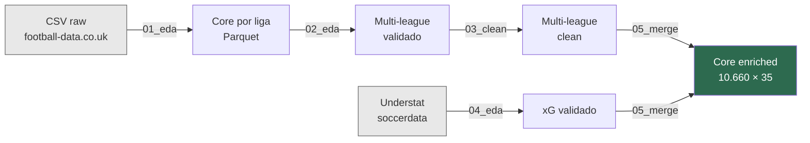
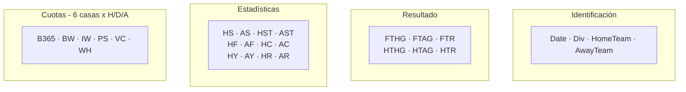

# 01 — EDA por liga

> Análisis exploratorio independiente de La Liga, Premier League y Bundesliga.
> Notebook: `notebooks/01_eda/01_eda_*.ipynb`

---

## Pipeline general

> [!NOTE]
> Este documento cubre la **primera etapa** del pipeline. El diagrama completo:

---

## Resumen ejecutivo

Se realizó un EDA sobre los datasets de tres ligas europeas. Cada análisis cubre **10 temporadas** (2014-15 a 2023-24), cargadas desde CSVs de [football-data.co.uk](https://www.football-data.co.uk/).

Objetivo: evaluar calidad, completitud e integridad para fundamentar un pipeline de limpieza unificado.

Los tres notebooks siguen una **metodología idéntica** → comparación directa entre ligas.

---

## Metodología

| Paso | Descripción |
|------|-------------|
| Carga | 10 CSVs raw por liga, inspección de dimensiones y tipos |
| Core | Columnas presentes en todas las temporadas (intersección) |
| Drift | Estabilidad de `dtypes` a lo largo de las 10 temporadas |
| Completitud | Nulos por variable y temporada |
| Integridad | FTR/HTR válidos, coherencia goles, duplicados, negativos |
| Cuotas | Casas presentes, completitud, cobertura |
| Export | Core por liga en Parquet + schema JSON |

---

## Hallazgos por liga

| Métrica | La Liga | Premier League | Bundesliga |
|---------|---------|----------------|------------|
| Partidos totales | 3.800 | 3.801 | 3.060 |
| Partidos/temporada | 380 (20 eq.) | 380 (20 eq.) | 306 (18 eq.) |
| Equipos únicos | 31 | 34 | 28 |
| Variables en core | 43 | 44 | 43 |
| Nulos en core | 633 (<0.5%) | 602 | 534 |
| Drift de tipos | Ninguno | Aparente | Ninguno |
| Duplicados | 0 | 0 | 0 |

> [!WARNING]
> **Premier 2014-15** contiene 1 fila completamente vacía (fila 380). Provoca drift aparente en 16 columnas (`int64` → `float64`) y un partido "fantasma". No es un cambio real de esquema.

### Particularidades

- **La Liga** — Core de 43 variables estable. Nulos concentrados en cuotas.
- **Premier** — Core de 44 variables (incluye `Referee`, ausente en otras ligas). Fila vacía a limpiar.
- **Bundesliga** — 18 equipos → 306 partidos/temporada. Sin anomalías.

---

## Core dataset identificado

**43 variables comunes** (intersección): 4 identificación + 6 resultado + 12 estadísticas + 21 cuotas.

---

## Calidad de cuotas

| Casa | Columnas | Estado |
|------|----------|--------|
| B365 (Bet365) | `B365H/D/A` | Estable |
| BW (bwin) | `BWH/D/A` | Estable |
| IW (interwetten) | `IWH/D/A` | ~50% nulos en 23-24 |
| PS (Pinnacle) | `PSH/D/A` + cierre | Estable |
| VC (VC Bet) | `VCH/D/A` | Estable |
| WH (William Hill) | `WHH/D/A` | Estable |

> [!CAUTION]
> Interwetten presenta degradación severa en la última temporada. Se descarta en la fase de limpieza.

---

## Validaciones superadas

| Check | Resultado |
|-------|-----------|
| Categorías FTR/HTR | Solo H, D, A |
| Coherencia FTR vs. goles | 0 inconsistencias |
| Duplicados | 0 |
| Valores negativos | 0 |
| Nombres de equipos | 0 colisiones |
| Cuotas en rango | [1.0, 100.0] |

---

## Artefactos

| Liga | Archivo | Shape |
|------|---------|-------|
| La Liga | `data/processed/laliga/core_validated.parquet` | 3.800 × 43 |
| Premier | `data/processed/premier/core_validated.parquet` | 3.801 × 44 |
| Bundesliga | `data/processed/bundesliga/core_validated.parquet` | 3.060 × 43 |

Cada parquet acompañado de su `core_schema.json`.

---

## Conclusión

Los tres EDA confirman **estabilidad estructural**, **coherencia interna** y **alta completitud**. Patrones de calidad homogéneos → viable un pipeline de limpieza unificado.

**Siguiente paso →** [02 — EDA Multi-league](02_eda_multi_league.md)
