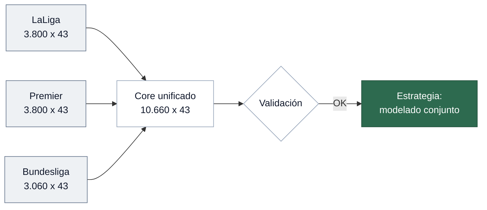

# 02 — EDA Multi-league

> Análisis comparativo de los tres core datasets para validar compatibilidad y decidir estrategia de modelado.
> Notebook: `notebooks/02_eda/02_eda_multi_league.ipynb`

---

## Objetivo

Determinar si La Liga, Premier y Bundesliga comparten un esquema suficientemente homogéneo para trabajar con un **dataset consolidado**, o si requieren pipelines separados.

---

## Core unificado

La intersección de los tres core individuales define **43 variables** comunes. `Referee` (solo Premier) queda excluida.

| Grupo | Nº | Variables |
|-------|----|-----------|
| Identificación | 4 | `Date`, `Div`, `HomeTeam`, `AwayTeam` |
| Resultados | 6 | `FTHG`, `FTAG`, `FTR`, `HTHG`, `HTAG`, `HTR` |
| Estadísticas | 12 | Tiros, faltas, córners, tarjetas (H/A) |
| Cuotas | 21 | 6 casas × H/D/A + variantes PS |

> [!TIP]
> **0 columnas con drift cross-league** — los `dtypes` son idénticos entre las tres ligas.

---

## Completitud cross-league

### Resultados y estadísticas

Completitud total en las tres ligas. El único nulo provenía de la fila vacía de Premier 2014-15, eliminada en el EDA individual.

### Cuotas

| Casa | La Liga | Premier | Bundesliga | Veredicto |
|------|---------|---------|------------|-----------|
| B365 | ≤0.03% | ≤0.03% | 0% | Estable |
| BW | ≤0.29% | ≤0.29% | ≤0.29% | Estable |
| IW | ~50% | ~48% | ~53% | Degradada |
| PS | ≤0.09% | ≤0.09% | ≤0.09% | Estable |
| VC | ≤0.03% | ≤0.03% | 0% | Estable |
| WH | ≤0.03% | ≤0.03% | ≤0.03% | Estable |

5 casas estables cross-league (≤5% nulos): B365, BW, PS, VC, WH.

---

## Validación del dataset consolidado

10.660 partidos (3.800 + 3.800 + 3.060):

| Check | Resultado |
|-------|-----------|
| Partidos por temporada | 380 (Liga/Premier), 306 (Bundesliga) |
| Rango temporal | Ago 2014 – Jun 2024 |
| Coherencia FTR vs. goles | 0 inconsistencias |
| Duplicados | 0 |
| Valores negativos | 0 |

---

## Decisión de estrategia

> [!IMPORTANT]
> **Modelado conjunto** con `Div` como feature categórica.

Justificación:
- Esquema idéntico (43 vars, mismos tipos)
- Patrones de calidad homogéneos entre ligas
- Maximiza volumen: 10.660 partidos
- La única diferencia (306 vs. 380 partidos/temporada) afecta volumen, no esquema

Si el rendimiento resulta inconsistente → evaluar segmentación por liga.

---

## Artefacto

| Archivo | Shape | Ligas |
|---------|-------|-------|
| `data/processed/core_multi_league_validated.parquet` | 10.660 × 43 | 3 |

Esquema en `data/processed/core_multi_league_schema.json`.

---

**Siguiente paso →** [03 — Limpieza](03_limpieza.md)
