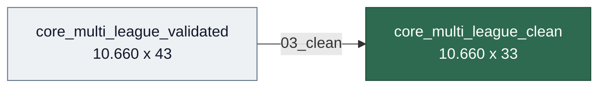

# 03 — Limpieza

> Transformaciones sobre el dataset validado para producir un dataset analítico limpio.
> Notebook: `notebooks/03_clean/03_clean_core.ipynb`

---

## Entrada / Salida



| | Entrada | Salida |
|---|---------|--------|
| Archivo | `core_multi_league_validated.parquet` | `core_multi_league_clean.parquet` |
| Filas | 10.660 | 10.660 |
| Columnas | 43 | 33 |
| Nulos | ~1.700 | 0 |

---

## Transformaciones

### 1. `Date` → datetime

Conversión a `datetime64`. Rango verificado: agosto 2014 – junio 2024.

### 2. `Div` → `League`

| Código | Liga |
|--------|------|
| `SP1` | `laliga` |
| `E0` | `premier` |
| `D1` | `bundesliga` |

Columna `Div` eliminada.

### 3. `match_id` (clave compuesta)

Formato: `YYYYMMDD_League_Home_Away` (nombres normalizados: strip, lowercase, sin espacios).
Unicidad verificada al 100%.

### 4. `Season` (derivada)

Corte temporada: julio (agosto → julio). 10 temporadas por liga: 2015–2024.

### 5. Selección de casas de apuestas

| Casa | Decisión | Razón |
|------|----------|-------|
| **B365** | Conservada | 100% cobertura, referencia retail |
| **PS** | Conservada | Referencia académica, apertura + cierre |
| IW | Eliminada | ~50% nulos en 2023-24 |
| BW | Eliminada | Redundante con B365 |
| VC | Eliminada | Redundante |
| WH | Eliminada | Redundante |

> [!NOTE]
> **12 columnas eliminadas** (4 casas × 3 cuotas). De 43 a 33 variables. Se conservan B365 (3 cols) y Pinnacle (6 cols: apertura + cierre).

### 6. Imputación de nulos en Pinnacle

Estrategia en cascada:

```
PS apertura (PSH/PSD/PSA)  → imputados con B365 equivalentes
PS cierre (PSCH/PSCD/PSCA) → imputados con PS apertura del mismo partido
```

Resultado: **0 nulos** en todas las columnas.

---

## Validación post-limpieza

| Check | Resultado |
|-------|-----------|
| FTR/HTR | {H, D, A} |
| `match_id` único | 10.660 |
| Nulos totales | 0 |
| Valores negativos | 0 |
| Filas conservadas | 10.660 |

---

## Dataset final

| Grupo | Columnas |
|-------|----------|
| Identificación | `League`, `Date`, `HomeTeam`, `AwayTeam`, `Season`, `match_id` |
| Resultado | `FTHG`, `FTAG`, `FTR`, `HTHG`, `HTAG`, `HTR` |
| Estadísticas | `HS`, `AS`, `HST`, `AST`, `HF`, `AF`, `HC`, `AC`, `HY`, `AY`, `HR`, `AR` |
| Cuotas B365 | `B365H`, `B365D`, `B365A` |
| Cuotas Pinnacle | `PSH`, `PSD`, `PSA`, `PSCH`, `PSCD`, `PSCA` |

---

## Tests

Suite en `tests/` ejecutable con `pytest`:

| Archivo | Tests | Qué valida |
|---------|-------|------------|
| `test_validated_outputs.py` | 13 | Dataset validado (entrada) |
| `test_clean_outputs.py` | 22 | Transformaciones, bookmakers, integridad |

---

## Artefactos

| Archivo | Descripción |
|---------|-------------|
| `data/processed/core_multi_league_clean.parquet` | Dataset limpio (10.660 × 33) |
| `data/processed/core_multi_league_clean_schema.json` | Esquema JSON |

---

**Siguiente paso →** [04 — Integración xG](04_integracion_xg.md)
