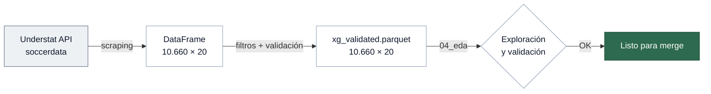

# 04 — Integración xG

> Extracción, exploración y validación de datos de Expected Goals desde Understat.
> Notebook: `notebooks/04_eda_xg/04_eda_xg.ipynb`

---

## Fuente de datos

| | |
|---|---|
| Proveedor | understat.com |
| Acceso | Scraping via `soccerdata` (`sd.Understat()`) |
| Cobertura | La Liga, Premier, Bundesliga — 2014-15 a 2023-24 |
| Modelo xG | Propio, utilizado en literatura académica |

### ¿Por qué Understat?

| Fuente | Acceso | Modelo xG | Complejidad |
|--------|--------|-----------|-------------|
| **Understat** | `soccerdata` | Propio (válido) | Baja |
| FBref (StatsBomb) | Scraping HTML | StatsBomb (gold standard) | Media-alta |
| Opta / StatsPerform | API de pago | Industrial | No accesible |

> [!TIP]
> Understat ofrece el mejor balance acceso/calidad para un proyecto académico. Si se necesita mayor precisión, FBref sería el siguiente paso.

---

## Pipeline de extracción



```python
import soccerdata as sd

us = sd.Understat(
    leagues=["ESP-La Liga", "ENG-Premier League", "GER-Bundesliga"],
    seasons=[f"{y}{y+1}" for y in range(14, 24)]
)
df_xg = us.read_schedule()
```

**10.660 partidos × 17 variables** — cobertura idéntica al core clean.

---

## Integridad del dataset xG

| Check | Resultado |
|-------|-----------|
| Duplicados | 0 |
| Nulos | 0 |
| Negativos | 0 |
| Drift de tipos | 0 |
| Partidos sin resultado | 0 |
| xG > 10 | 0 |
| Goles vs. core | Consistentes en las 3 ligas |

---

## Compatibilidad con football-data

> [!WARNING]
> Las dos fuentes usan nomenclaturas diferentes. Es necesario mapear antes del merge.

| Aspecto | Understat | Core clean | Solución |
|---------|-----------|------------|----------|
| Equipos | Nombres completos | Abreviados | `config/team_mapping_xg.json` |
| Ligas | `ENG-Premier League` | `premier` | `config/league_mapping.json` |
| Temporadas | `1415` | `2015` | Mapping cronológico |
| Fechas | Posible ±1 día (UTC) | Hora local | Excluir del `match_id` |

### Mapping de equipos

34 equipos requieren mapeo manual entre nomenclaturas:

| Liga | Equipos mapeados |
|------|-----------------|
| Premier | 7 |
| La Liga | 11 |
| Bundesliga | 16 |

### Problema de fechas

> [!CAUTION]
> Los partidos nocturnos pueden cambiar de día según si el proveedor usa UTC u hora local. La solución robusta es **excluir la fecha del `match_id`** y usar una clave jerárquica: `Season_League_Home_Away`.

---

## Variables seleccionadas para el merge

De las 17 columnas del dataset xG, solo se incorporan al merge:

| Variable | Uso |
|----------|-----|
| `home_xg` | Feature principal |
| `away_xg` | Feature principal |
| `home_goals` / `away_goals` | Validación cruzada del join |

---

## Tests

| Archivo | Tests | Qué valida |
|---------|-------|------------|
| `test_xg_outputs.py` | 21 | Estructura, cobertura, integridad, compatibilidad |

---

## Artefactos

| Archivo | Descripción |
|---------|-------------|
| `data/processed/xg/xg_validated.parquet` | Dataset xG validado (10.660 × 20) |
| `data/processed/xg/xg_validated_schema.json` | Esquema JSON |
| `config/league_mapping.json` | Mapping de ligas |
| `config/team_mapping_xg.json` | Mapping de equipos (34 entradas) |

---

**Siguiente paso →** [05 — Merge xG](05_merge_xg.md)
