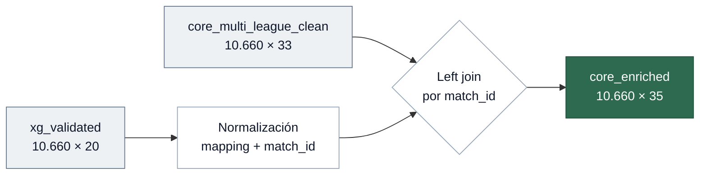
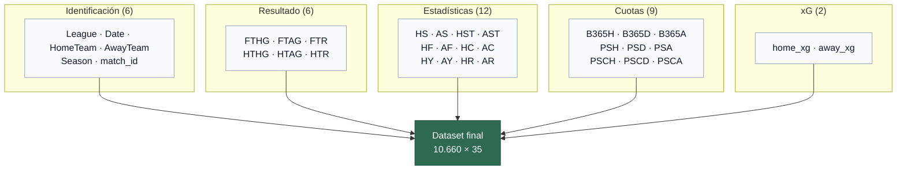

# 05 — Merge xG

> Unión del core clean con los datos de Expected Goals para producir el dataset final enriquecido.
> Notebook: `notebooks/05_merge/05_merge_xg.ipynb`

---

## Entrada / Salida

| | Core clean | xG validated | Enriched |
|---|-----------|-------------|----------|
| Filas | 10.660 | 10.660 | 10.660 |
| Columnas | 33 | 20 | 35 |
| Nulos | 0 | 0 | 0 |

---

## Normalización del dataset xG

Antes del join, se normalizan las nomenclaturas del xG para coincidir con el core:

| Paso | Antes | Después |
|------|-------|---------|
| Equipos | Nombres completos (Understat) | Abreviados (football-data) |
| Ligas | `ENG-Premier League` | `premier` |
| Temporadas | — | `2015`, ..., `2024` (corte julio) |
| Fechas | `datetime64[ns]` con hora | Truncado a fecha |
| `match_id` | — | `YYYYMMDD_League_Home_Away` |

### Team mapping

34 equipos mapeados via `config/team_mapping_xg.json`:

| Liga | Equipos |
|------|---------|
| Premier | 7 |
| La Liga | 11 |
| Bundesliga | 16 |

---

## Merge

| Aspecto | Detalle |
|---------|---------|
| Tipo | Left join |
| Clave | `match_id` |
| Cobertura | 100% (10.660/10.660) |
| Columnas añadidas | `home_xg`, `away_xg` |

> [!IMPORTANT]
> El merge logra **100% de cobertura** — todos los partidos del core tienen su xG correspondiente. Cualquier fallo aquí indicaría equipos sin mapear.

---

## Validación post-merge

| Check | Resultado |
|-------|-----------|
| Shape | 10.660 × 35 |
| `match_id` único | 10.660 |
| Nulos en xG | 0 |
| xG negativos | 0 |
| xG máximo | < 10 |
| Goles core vs. enriched | Idénticos |
| Columnas del core preservadas | Todas |

---

## Dataset final

**10.660 partidos × 35 columnas** — 3 ligas × 10 temporadas.

| Métrica | Valor |
|---------|-------|
| Partidos | 10.660 |
| Columnas | 35 |
| Ligas | bundesliga, laliga, premier |
| Temporadas | 10 (2015–2024) |
| Nulos | 0 |

### Distribución del target FTR

| Resultado | Porcentaje |
|-----------|------------|
| H (local) | 45.2% |
| D (empate) | 24.7% |
| A (visitante) | 30.1% |

> [!NOTE]
> Distribución desequilibrada esperada — ventaja local consistente en las tres ligas. Los modelos deben manejar este desbalance explícitamente.

---

## Tests

| Archivo | Tests | Qué valida |
|---------|-------|------------|
| `test_enriched_outputs.py` | 15 | Estructura, xG, integridad del merge, datos |

Suite acumulada del pipeline: **82 tests** distribuidos en 5 archivos (incluye `test_common.py` con fixtures compartidas), ejecutables con `pytest tests/ -v`.

---

## Artefactos

| Archivo | Descripción |
|---------|-------------|
| `data/processed/enriched/core_enriched.parquet` | Dataset enriquecido (10.660 × 35) — fuente de verdad, NO modificar |
| `data/processed/enriched/core_enriched_schema.json` | Esquema JSON |
| `config/team_mapping_xg.json` | Mapping de equipos |
| `config/league_mapping.json` | Mapping de ligas |

---

**Siguiente paso →** [06 — Feature Engineering](06_features.md)
