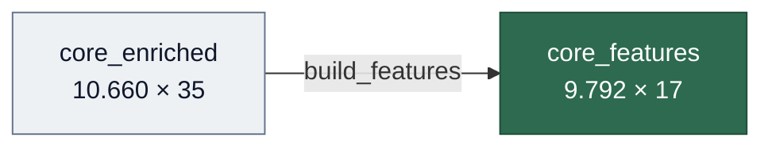
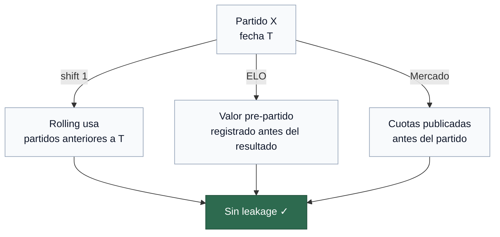

# 06 — Feature Engineering

> Construcción del `core_features` a partir de `core_enriched`: 10 features + target `ftr`.
> Notebook: `notebooks/06_features/06_features.ipynb`

---

## Entrada / Salida



| | Entrada | Salida |
|---|---------|--------|
| Archivo | `core_enriched.parquet` | `core_features.parquet` |
| Filas | 10.660 | 9.792 |
| Columnas | 35 | 17 |
| Nulos | 0 | 0 |

868 partidos eliminados por cold start (8.1%) — primeros partidos de cada equipo sin historial suficiente.

---

## Convención de nombres

Las features siguen el patrón `métrica_diff_scope`:

| Segmento | Descripción | Ejemplos |
|---|---|---|
| `métrica` | Qué se mide | `goal`, `xg`, `sot`, `points`, `rest_days`, `prob`, `elo` |
| `diff` | Diferencia local − visitante | siempre presente |
| `scope` | Ámbito del cálculo | `global`, `venue`, `market` |

Las features rolling incluyen además la ventana: `métrica_diff_lastN_scope`.

`rest_days_diff` y `elo_diff_pre` no tienen scope porque no existe versión global/venue de esas métricas.

---

## Features calculadas

| Feature | Bloque | Cold start | Fuente |
|---|---|---|---|
| `elo_diff_pre` | ELO | No — arranca en `ELO_BASE` | Calculado |
| `points_diff_global` | Clasificación | No — arranca en 0 | `FTR` |
| `points_diff_venue` | Clasificación | No — arranca en 0 por rol | `FTR` |
| `goal_diff_last5_global` | Rolling global | Sí | `FTHG`, `FTAG` |
| `goal_diff_last5_venue` | Rolling por localía | Sí | `FTHG`, `FTAG` |
| `sot_diff_last5_global` | Rolling global | Sí | `HST`, `AST` |
| `xg_diff_last5_global` | Rolling global | Sí | `home_xg`, `away_xg` |
| `xg_conceded_diff_last5_global` | Rolling global | Sí | `home_xg`, `away_xg` |
| `rest_days_diff` | Descanso | Sí | `Date` |
| `prob_diff_market` | Mercado | No | `PSCH`, `PSCD`, `PSCA` |

> [!IMPORTANT]
> **Cold start:** los partidos con NaN en cualquier feature rolling son eliminados del `core_features`. Existen en `matches` pero no en `match_features`.

---

## Parámetros

| Parámetro | Valor | Descripción |
|---|---|---|
| `WINDOW` | 5 | Ventana rolling — partidos mínimos para calcular media representativa |
| `ELO_K` | 20 | K-factor ELO — sensibilidad por partido |
| `ELO_BASE` | 1500 | Rating inicial para todos los equipos |

---

## Implementación

### Arquitectura del módulo

```
src/features/
    build_features.py   — orquestador del pipeline completo
    _constants.py       — FEATURES, FEATURES_ROLLING, WINDOW, ELO_K, ELO_BASE
    _team_view.py       — _build_team_view (vista por equipo, base de todos los cálculos)
    elo.py              — cálculo del rating ELO acumulado
    form.py             — features rolling (goal_diff, xg_diff, sot_diff)
    table.py            — clasificación acumulada (points_diff) y rest_days_diff
    market.py           — prob_diff_market (cuotas Pinnacle)
    leakage.py          — check_leakage
    __init__.py         — exports públicos
```

### `_build_team_view`

Helper interno que convierte el dataset de partidos en una vista por equipo — cada partido genera dos filas (local y visitante). Es la base común de todas las funciones vectorizadas.

```
match_id, Date, Season, League, team, is_home, gf, gc, xgf, xgc, sot, soc
```

### Anti-leakage

> [!WARNING]
> Toda feature debe usar exclusivamente información anterior al partido. Violación = data leakage.

Dos mecanismos según el tipo de feature:

| Mecanismo | Aplica a |
|---|---|
| `shift(1)` antes de `rolling`/`cumsum` | Rolling global, rolling venue, clasificación, descanso |
| Valor pre-partido por construcción | ELO — se registra antes de actualizar los ratings |
| Información pública anterior al partido | Mercado — cuotas Pinnacle de cierre |



### `build_features`

Orquestador del pipeline completo:

```
1. Ordenar cronológicamente
2. Calcular cada bloque de forma independiente
3. Join por match_id
4. check_leakage — verifica NaN en primer partido de cada equipo
5. dropna(subset=FEATURES_ROLLING) — elimina cold start
```

---

## Decisiones de diseño

- **Pinnacle vs Bet365** — se usan cuotas Pinnacle de cierre (`PSCH/PSCD/PSCA`) por su menor margen (~1.02–1.03 vs ~1.05 de Bet365) y porque las cuotas de cierre incorporan el consenso final del mercado. Bet365 se incluye como contraste en el notebook.
- **K=20 en ELO** — equilibrio estándar en literatura de predicción de fútbol: K bajo insensibiliza el rating; K alto lo vuelve volátil.
- **WINDOW=5** — mínimo estadísticamente representativo sin sacrificar demasiados partidos por cold start.

---

## Cobertura del core_features

| Liga | Partidos | Temporadas |
|---|---|---|
| `bundesliga` | 2.796 | 2015–2024 |
| `laliga` | 3.511 | 2015–2024 |
| `premier` | 3.485 | 2015–2024 |
| **Total** | **9.792** | |

---

## Tests

| Archivo | Tests | Qué valida |
|---------|-------|------------|
| `test_features.py` | 24 | Schema, anti-leakage, ELO, mercado, parquet |

Suite completa del pipeline: **106 tests** distribuidos en 6 archivos, ejecutables con `pytest tests/ -v`.

---

## Artefactos

| Archivo | Descripción |
|---------|-------------|
| `data/processed/features/core_features.parquet` | Dataset de features (9.792 × 17) |
| `data/processed/features/core_features_schema.json` | Esquema JSON |
| `src/features/build_features.py` | Módulo de feature engineering |

---

**Siguiente paso →** [07 — EDA Analítico de Features](07_eda_analitico.md)
