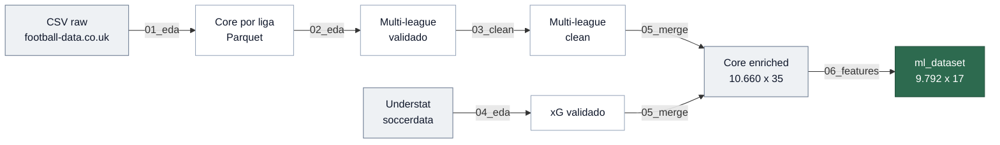
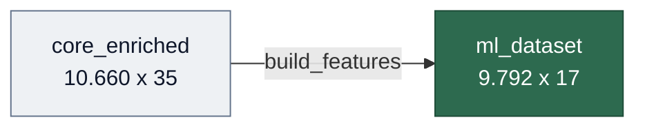
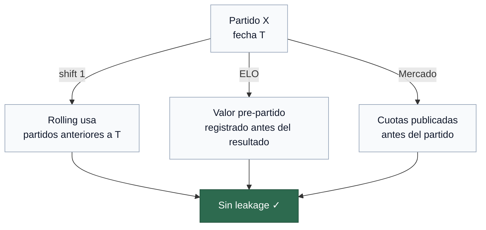

# 06 — Feature Engineering

> Construcción del `ml_dataset` a partir de `core_enriched`: 10 features + target `ftr`.
> Notebook: `notebooks/06_features/06_features.ipynb`

---

## Pipeline general

> [!NOTE]
> Este documento cubre la **fase de feature engineering**. El diagrama completo:



---

## Entrada / Salida



| | Entrada | Salida |
|---|---------|--------|
| Archivo | `core_enriched.parquet` | `ml_dataset.parquet` |
| Filas | 10.660 | 9.792 |
| Columnas | 35 | 17 |
| Nulos | 0 | 0 |

868 partidos eliminados por cold start (8.1%) — primeros partidos de cada equipo sin historial suficiente.

---

## Features calculadas

| Feature | Bloque | Cold start | Fuente |
|---|---|---|---|
| `elo_diff_pre` | ELO | No — arranca en `ELO_BASE` | Calculado |
| `goal_diff_last5_global` | Rolling global | Sí | `FTHG`, `FTAG` |
| `xg_diff_last5_global` | Rolling global | Sí | `home_xg`, `away_xg` |
| `xg_conceded_diff_last5_global` | Rolling global | Sí | `home_xg`, `away_xg` |
| `sot_diff_last5_global` | Rolling global | Sí | `HST`, `AST` |
| `goal_diff_last5_venue` | Rolling por localía | Sí | `FTHG`, `FTAG` |
| `points_diff_table` | Clasificación | No — arranca en 0 | `FTR` |
| `venue_win_rate_diff` | Clasificación | Sí | `FTR` |
| `rest_days_diff` | Descanso | Sí | `Date` |
| `prob_diff_market` | Mercado | No | `PSH`, `PSD`, `PSA` |

**Cold start:** los partidos con NaN en cualquier feature con cold start son eliminados del `ml_dataset`. Existen en `matches` pero no en `match_features`.

---

## Parámetros

| Parámetro | Valor | Descripción |
|---|---|---|
| `WINDOW` | 5 | Ventana rolling — partidos mínimos para calcular media representativa |
| `ELO_K` | 20 | K-factor ELO — sensibilidad por partido |
| `ELO_BASE` | 1500 | Rating inicial para todos los equipos |

---

## Implementación

### Arquitectura del módulo

```
src/features/
    build_features.py   — pipeline completo + funciones por bloque
    __init__.py         — exports públicos
```

### `_build_team_view`

Helper interno que convierte el dataset de partidos en una vista por equipo — cada partido genera dos filas (local y visitante). Es la base común de todas las funciones vectorizadas.

```
match_id, Date, Season, League, team, is_home, gf, gc, xgf, xgc, sot, soc
```

### Anti-leakage

Dos mecanismos según el tipo de feature:

| Mecanismo | Aplica a |
|---|---|
| `shift(1)` antes de `rolling`/`cumsum` | Rolling global, rolling venue, clasificación, descanso |
| Valor pre-partido por construcción | ELO — se registra antes de actualizar los ratings |
| Información pública anterior al partido | Mercado — cuotas Pinnacle de cierre |



### `build_features`

Orquestador del pipeline completo:

```
1. Ordenar cronológicamente
2. Calcular cada bloque de forma independiente
3. Join por match_id
4. check_leakage — verifica NaN en primer partido de cada equipo
5. dropna(subset=FEATURES_ROLLING) — elimina cold start
```

---

## Decisiones de diseño

- **Pinnacle vs Bet365** — se usan cuotas Pinnacle de cierre (`PSH/PSD/PSA`) por su menor margen (~1.02–1.03 vs ~1.05 de Bet365) y porque las cuotas de cierre incorporan el consenso final del mercado tras días de flujo de apuestas. Bet365 se incluye como contraste de robustez en el notebook.
- **K=20 en ELO** — equilibrio estándar en literatura de predicción de fútbol: K bajo insensibiliza el rating; K alto lo vuelve volátil.
- **WINDOW=5** — mínimo estadísticamente representativo sin sacrificar demasiados partidos por cold start.
- **LR como modelo base** — se usa intencionalmente Logistic Regression para aislar el efecto de las features entre los tres modelos preentrenados. La comparación de algoritmos se realiza en el modo custom (`/studio`).

---

## Modelos preentrenados

Mismo algoritmo (LR) en los tres para aislar el efecto de las features:

| Modelo | Features |
|---|---|
| `baseline` | `elo_diff_pre`, `points_diff_table`, `goal_diff_last5_global` |
| `extended` | baseline + `xg_diff_last5_global`, `xg_conceded_diff_last5_global`, `sot_diff_last5_global`, `rest_days_diff`, `goal_diff_last5_venue`, `venue_win_rate_diff` |
| `market` | extended + `prob_diff_market` |

---

## Split temporal

| Split | Criterio | Partidos |
|---|---|---|
| Train | `Season ≤ 2022` | ~7.900 |
| Validation | `Season == 2023` | ~950 |
| Test | `Season == 2024` | ~950 |

> [!IMPORTANT]
> Nunca split aleatorio — el fútbol es una serie temporal. El test set nunca se usa hasta la evaluación final.

---

## Cobertura del ml_dataset

| Liga | Partidos | Temporadas |
|---|---|---|
| `bundesliga` | 2.796 | 2015–2024 |
| `laliga` | 3.511 | 2015–2024 |
| `premier` | 3.485 | 2015–2024 |
| **Total** | **9.792** | |

---

## Tests

| Archivo | Tests | Qué valida |
|---------|-------|------------|
| `test_features.py` | 18 | Schema, anti-leakage, ELO, mercado, parquet |

Suite completa del pipeline: **100+ tests** distribuidos en 5 archivos, ejecutables con `pytest tests/ -v`.

---

## Artefactos

| Archivo | Descripción |
|---------|-------------|
| `data/processed/ml_dataset.parquet` | Dataset de features (9.792 × 17) |
| `data/processed/ml_dataset_schema.json` | Esquema JSON |
| `src/features/build_features.py` | Módulo de feature engineering |

---

**Siguiente paso →** Fase 7 — Modelado