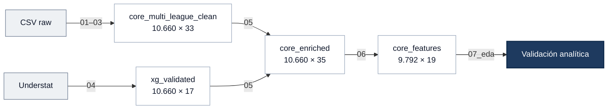

# 07 — EDA Analítico de Features

> Análisis estadístico del `core_features` para validar las 12 features antes del modelado.
> Notebook: `notebooks/07_eda_features/07_eda_analitico_features.ipynb`

---

## Objetivo

Verificar que las features construidas en Feature Engineering son estadísticamente válidas y aptas para modelado:

- Verificar distribuciones, outliers y asimetrías de las 12 features
- Detectar colinealidad entre features
- Medir poder discriminativo de cada feature respecto al target `FTR` (η²)
- Documentar la calidad y señal de cada feature como referencia para el entrenamiento de modelos

---

## Contexto en el pipeline

---

## Metodología

| Sección | Técnica | Pregunta |
|---------|---------|----------|
| Distribución target | Barplot con % | ¿Qué baseline de accuracy ofrece el dataset? |
| Estadísticos descriptivos | describe + skewness + kurtosis | ¿Hay features sesgadas o con colas pesadas? |
| Histogramas | 12 histogramas con media | ¿Cómo se distribuye cada feature? |
| Correlación | Heatmap Pearson triangular | ¿Qué pares de features están colineales? |
| Violin plots | Por clase FTR (H/D/A) | ¿Separa cada feature las tres clases? |
| η² (correlation ratio) | Barplot ordenado | ¿Qué features tienen más señal respecto al target? |

---

## Distribución del target en core_features

| Resultado | Porcentaje |
|-----------|------------|
| H (local) | 45.6% |
| D (empate) | 24.7% |
| A (visitante) | 29.8% |

> [!IMPORTANT]
> **Baseline de accuracy: 45.6%** — predecir siempre victoria local. Cualquier modelo debe superar este umbral para aportar valor.

La distribución en `core_features` difiere ligeramente de `core_enriched` (H=45.2%, A=30.1%) porque los 868 partidos eliminados por cold start no se distribuyen uniformemente entre clases.

---

## Distribuciones y outliers

### Estadísticos descriptivos

| Feature | Media | Std | Skew | Kurtosis |
|---------|-------|-----|------|----------|
| `elo_diff_pre` | -1.285 | 134.0 | 0.00 | 0.13 |
| `points_diff_global` | -0.188 | 15.0 | -0.02 | 1.46 |
| `points_diff_venue` | 3.926 | 8.5 | 0.45 | 0.95 |
| `goal_diff_last5_global` | -0.073 | 1.44 | 0.02 | 0.25 |
| `xg_diff_last5_global` | -0.076 | 1.11 | 0.01 | 0.16 |
| `xg_conceded_diff_last5_global` | 0.039 | 0.62 | 0.00 | 0.01 |
| `sot_diff_last5_global` | -0.208 | 3.02 | 0.01 | 0.07 |
| `goal_diff_last5_venue` | 0.699 | 1.44 | 0.06 | 0.24 |
| `rest_days_diff` | -0.017 | 2.72 | 0.04 | **802.9** |
| `prob_diff_market` | 0.138 | 0.37 | -0.25 | -0.45 |
| `h2h_goal_diff_last5` | -0.021 | 0.83 | -0.11 | **3.53** |
| `h2h_result_diff_last5` | -0.010 | 0.36 | -0.03 | 1.36 |

**Sin asimetrías relevantes** — ninguna feature supera |skewness| > 1.

### Alertas de curtosis

**`rest_days_diff` — kurtosis = 802**

Causada por el parón COVID-19 (temporada 2020). Outliers de hasta ±102 días en 248 partidos afectados, con solo 4 casos extremos. No requiere tratamiento adicional.

| Liga | Partidos post-COVID |
|------|---------------------|
| Bundesliga | 46 |
| Premier | 92 |
| La Liga | 110 |
| **Total** | **248** |

**`h2h_goal_diff_last5` — kurtosis = 3.5**

Distribución picuda con mediana y Q3 = 0. Causada por el `fillna(0)` del cold start H2H: 5.251 partidos (53.6%) sin historial previo suficiente se imputan a 0, acumulando la masa en cero. No requiere tratamiento — 0 codifica correctamente "sin historial previo conocido".

---

## Colinealidad entre features

Pares con correlación de Pearson |r| > 0.70:

| Par | r | Explicación |
|-----|---|-------------|
| `prob_diff_market` ↔ `elo_diff_pre` | 0.91 | Ambas miden diferencia de nivel entre equipos |
| `h2h_goal_diff_last5` ↔ `h2h_result_diff_last5` | 0.91 | Misma señal H2H con métrica distinta |
| `points_diff_global` ↔ `points_diff_venue` | 0.84 | Clasificación general y por localía muy similares |
| `xg_diff_last5_global` ↔ `sot_diff_last5_global` | 0.83 | Más tiros implica más xG por construcción |
| `elo_diff_pre` ↔ `points_diff_global` | 0.83 | ELO y clasificación reflejan nivel similar |

Las dos features H2H son internamente redundantes (r=0.91) — capturan la misma señal histórica con métricas distintas. Presentan además correlación moderada con ELO (~0.57) y mercado (~0.50): equipos históricamente dominantes en el H2H tienden a ser también los mejores en el ranking general.

> [!NOTE]
> La colinealidad es manejable: los modelos están diseñados por bloques conceptuales y las features colineales no siempre conviven en el mismo modelo. `rest_days_diff` es la única feature ortogonal al resto (r ≈ 0 con todas).

---

## Poder discriminativo — η² (correlation ratio)

η² mide la varianza de cada feature explicada por el resultado (`FTR`). Rango [0, 1].

| Nivel | Feature | η² |
|-------|---------|-----|
| Alto | `prob_diff_market` | 0.189 |
| Alto | `elo_diff_pre` | 0.148 |
| Medio-alto | `points_diff_global` | 0.110 |
| Medio-alto | `xg_diff_last5_global` | 0.102 |
| Medio-alto | `sot_diff_last5_global` | 0.096 |
| Medio | `goal_diff_last5_global` | 0.084 |
| Medio | `goal_diff_last5_venue` | 0.082 |
| Medio | `points_diff_venue` | 0.080 |
| Bajo | `h2h_goal_diff_last5` | 0.050 |
| Bajo | `xg_conceded_diff_last5_global` | 0.049 |
| Bajo | `h2h_result_diff_last5` | 0.044 |
| Residual | `rest_days_diff` | ≈ 0.000 |

Las features H2H se sitúan en el nivel bajo, comparables a `xg_conceded_diff_last5_global`. Su señal está atenuada porque el 49% de valores son exactamente 0 por el `fillna(0)` del cold start — en el subconjunto de partidos con historial H2H real, su contribución será mayor. `h2h_goal_diff_last5` muestra ligeramente mayor señal que `h2h_result_diff_last5` (η²=0.050 vs 0.044).

---

## Artefactos

| Artefacto | Descripción |
|-----------|-------------|
| `notebooks/07_eda_features/07_eda_analitico_features.ipynb` | Notebook con análisis completo y visualizaciones |

Este EDA no produce ningún parquet — es únicamente análisis y validación. El dataset de entrada (`core_features.parquet`) permanece inalterado.

---

**Siguiente paso →** Base de datos (star schema con SQLModel)
